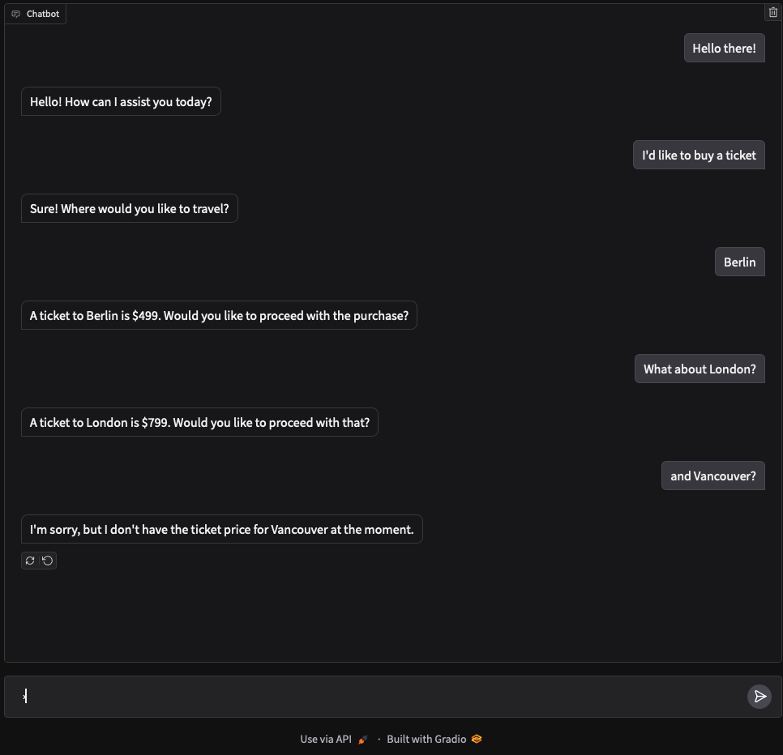

# FlightAI Chatbot

FlightAI Chatbot is an airline customer support chatbot designed to assist users with basic queries. It provides quick and accurate responses, including ticket prices for popular destinations. This chatbot is powered by OpenAI's GPT model and Gradio for a simple web-based user interface.

## Features

- Short, Accurate Responses: The assistant provides short, courteous answers in response to customer questions.
- Ticket Price Lookup: Automatically retrieves the price of a return ticket to specific cities when asked.
- Tool Functionality: Uses function calling to retrieve specific information when needed, keeping responses accurate and relevant.
- Web Interface: Built with Gradio to create an interactive chatbot experience.

## Getting Started

Follow these instructions to set up and run the chatbot locally.

### Prerequisites

- Python 3.7+
- Required packages: openai, gradio, python-dotenv

### Installation

1. Clone the Repository

```
git clone https://github.com/your-username/flightai-chatbot.git
cd flightai-chatbot
```

2. Install Dependencies

```
pip install -r requirements.txt
```

3. Set Up Environment Variables
   - Create a `.env` file in the root directory of the project.
   - Add your OpenAI API key to the `.env` file:

```
OPENAI_API_KEY=your_openai_api_key
```

4. Run the Chatbot

```
python main.py
```

This will start a Gradio interface where you can interact with the chatbot.

### Usage

Once the chatbot is running, it will respond to customer queries related to airline tickets. For example, ask it:

- “How much is a ticket to London?”
- “What’s the price for a return ticket to Tokyo?”

The chatbot will return the price based on the cities defined in the ticket_prices dictionary. If the city is not in the dictionary, it will respond with "Unknown."



## Code Overview

- `get_ticket_price` Function: Looks up ticket prices based on city names.
- `price_function` JSON: Defines the structure and parameters for the chatbot’s ticket price lookup functionality.
- `handle_tool_call` Function: Handles the tool call by fetching the ticket price and returning a formatted response.
- `chat` Function: Orchestrates the conversation flow and interacts with OpenAI's GPT model.

## Customization

To add more cities and prices, simply update the ticket_prices dictionary in the code.

## Dependencies

- openai: Used to interact with the OpenAI API.
- gradio: For creating the web-based chat interface.
- dotenv: For loading environment variables from the .env file.
