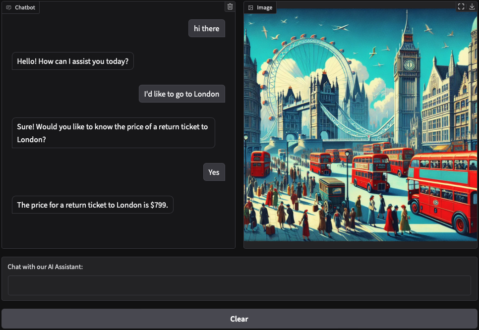

# FlightAI Chatbot

FlightAI Chatbot is an airline customer support chatbot designed to assist users with basic queries, providing quick and accurate responses, including ticket prices for popular destinations. This chatbot is powered by OpenAI's GPT model, Gradio for the web interface, and a structured modular design for easy maintenance.

## Features

- **Short, Accurate Responses**: The assistant provides concise, courteous answers to customer inquiries.
- **Ticket Price Lookup**: Retrieves ticket prices for specific destinations.
- **Image Generation**: Generates a themed image for selected destinations using DALL-E.
- **Text-to-Speech**: Converts responses to audio using OpenAI’s TTS capabilities.
- **Web Interface**: Built with Gradio to create an interactive chatbot experience.

## Getting Started

Follow these instructions to set up and run the chatbot locally.

### Prerequisites

- Python 3.7+
- Required packages: `openai`, `gradio`, `python-dotenv`, `pydub`

### Installation

1. Clone the Repository

```
git clone https://github.com/your-username/flightai-chatbot.git
cd flightai-chatbot
```

2. Install Dependencies

```
pip install -r requirements.txt
```

3. Set Up Environment Variables
   - Create a `.env` file in the root directory of the project.
   - Add your OpenAI API key to the `.env` file:

```
OPENAI_API_KEY=your_openai_api_key
```

4. Run the Chatbot

```
python main.py
```

This will start a Gradio interface where you can interact with the chatbot.

### Usage

Once the chatbot is running, it will respond to customer queries related to airline tickets. For example, ask it:

- “How much is a ticket to London?”
- “What’s the price for a return ticket to Tokyo?”

The chatbot will return the price based on the cities defined in the ticket_prices dictionary. If the city is not in the dictionary, it will respond with "Unknown."




## Code Overview

The project is organized into separate modules for clarity and ease of maintenance:

```
openai-assistant-chatbot/
├── main.py                # Entry point
├── config.py              # Load environment variables and OpenAI setup
├── chatbot.py             # Chatbot handling logic
├── tools.py               # Tool functions
├── artist.py              # Image generation logic
├── talker.py              # Text-to-speech function
├── ui.py                  # Gradio UI setup
├── .env                   # Environment variables
└── requirements.txt       # Dependencies
```

- `config.py`: Manages environment variables and initializes the OpenAI API.
- `tools.py`: Contains utility functions, including `get_ticket_price` for ticket price lookups and `handle_tool_call` to process tool requests.
- `artist.py`: Defines `artist`, a function that generates images using DALL-E based on the destination city.
- `talker.py`: Contains the `talker` function to convert chatbot responses into audio playback.
- `chatbot.py`: Coordinates the chat interaction with OpenAI's model, including handling tool calls and adding generated images or audio.
- `ui.py`: Sets up the Gradio interface, linking user input and bot responses to create a smooth interactive experience.
- `main.py`: The entry point for the chatbot application, initializing the Gradio UI and starting the app.

## Customization

To add more cities and prices, simply update the ticket_prices dictionary in the code.

## Dependencies

- openai: Used to interact with the OpenAI API.
- gradio: For creating the web-based chat interface.
- dotenv: For loading environment variables from the .env file.

## Troubleshooting

If you have any problems running this code (like a FileNotFound error, or a warning of a missing package), you may need to install FFmpeg, a very popular audio utility.

```
brew install ffmpeg
```
